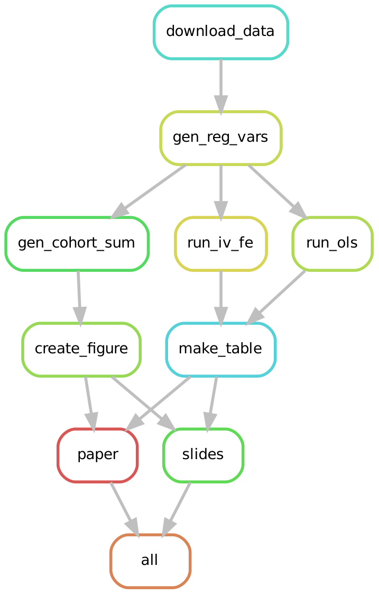

# Replicate MHE Table 4.1.1 and Figure 4.1.1

[](https://travis-ci.org/lachlandeer/angrist-krueger-1991)
[](https://www.tidyverse.org/lifecycle/#experimental)
[]()

## What this repo does

We replicate Table 4.1.1 and Figure 4.1.1 from Mostly Harmless Econometrics using a reproducible research workflow.

Our weapons of choice are:

* `Snakemake` to manage the build and dependencies
* `R` for statistical analysis

## How to Build this repo

If you have Snakemake and R installed, navigate your terminal to this directory.

### Installing Missing R packages

To ensure all R libraries are installed, type

```
snakemake install_packages
```
into a your terminal and press `RETURN`.

If you modify the packages used in this repo, you should rerun this command to store package updates in the `REQUIREMENTS.txt`.

### Building the Output
Type:

```
snakemake all
```

into a your terminal and press `RETURN`

See [`HELP.txt`](HELP.txt) for explanation of what the Snakemake Rules are doing.

## Install instructions

### Installing `R`

* Install the latest version of `R` by following the instructions
  [here](https://pp4rs.github.io/installation-guide/r/).
    * You can ignore the RStudio instructions for the purpose of this project.

### Installing `Snakemake`

This project uses `Snakemake` to execute our research workflow.
You can install snakemake as follows:
* Install Snakemake from the command line (needs pip, and Python)
    ```
    pip install snakemake
    ```
    * If you haven't got Python installed click [here](https://pp4rs.github.io/installation-guide/python/) for instructions

* Windows and old Mac OSX users: you may need to manually install the `datrie` package if you are getting errors. Using conda, this seems to work best:

    ```
    conda install datrie
    ```

### Installing pandoc and LaTeX

Because we want to generate pdf outputs we need two additional bits of software to make that happen:

* If you do not have RStudio installed, you will have to install Pandoc (http://pandoc.org)
* If you do not have LaTeX installed, we recommend that you install TinyTeX (https://yihui.name/tinytex/)
  * TinyTeX is a lightweight, portable, cross-platform, and easy-to-maintain LaTeX distribution.
  - From inside R:
    ```{r}
    install.packages('tinytex')
    tinytex::install_tinytex()  # install TinyTeX
    ```

## Visualization of the Workflow

Snakemake workflows are a directed acyclic graph (DAG).
We can visualize the relationship between the rules (a simplified view of the DAG) in our workflow:



Check out the rules in for various visualizations of the workflow near the bottom of the `Snakefile` in the 'Snakemake Workflow graphs'. 
You will need to install `graphviz` to run these rules - we have included a rule inside `dag.smk` to install this for you. 

## Updates to Workflow Example

Periodic updates the workflow occur as I find better/simpler ways to do things and as my opinions on best practice evolve.
Major changes are tracked in the [NEWS file](./NEWS.md) with brief descriptions of the changes implemented.

## Comments / Suggestions / Issues

I'd love to hear your comments, suggestions or installation issues encountered when running the example.
[Post an issue on Github.](https://github.com/lachlandeer/angrist-krueger-1991/issues)

## Suggested Citation:

Deer, Lachlan, 2020. "Replication of Angrist and Krueger (1991) with Snakemake : Table 4.1.1 and Figure 4.1.1 from Mostly Harmless Econometrics.
